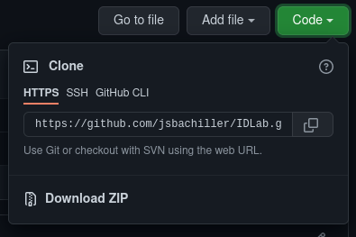

# Data management with R and RStudio
### Javier Sánchez Bachiller
##### Higher School of Economics
*jsbachiller.work@gmail.com*

---

*This set of small documents is an adaptation of the slides presented during the seminar.*

---

# --- 1. Tools ------------------------------------------------------

We will now review the tools we are going to use and how to get them and set them up. Most likely all of you have R in your system already, but if you are not a habitual user you should anyways update both R and RStudio and even it may pay off to make a new clean installation, as this will spare you some headaches.

## 1.1. R

R is nowadays one of the most popular programming languages for data analysis 
along with Python. Some of the reasons for this are that it is:

- Easy-to-learn language
- Specially popular in economics and health sciences
- Scalable to big-data ecosystems like Spark
- A language with a large community behind it, constant and steady development
- Used in leading research institutions and universities around the world
- Available in all platforms
- Free

#### Why R instead of Stata?
- Freely available
- No OS limitations

#### Why R instead of Python?
- More common among finance and economics topics
- Easier to install and set-up (out-of-the-box)

In order to install it, just visit [R's official webpage](https://cloud.r-project.org/index.html), select your OS and download the latest `base` version. 


## 1.2. RStudio

As with any other programming language, an IDE (integrated development environment) is fundamental when trying to develop a clean and efficient workflow. RStudio is the best IDE for R, it's an *All-in-one*: Editor, console, viewer, data and document manager. Besides, it has perfect integration with Git and great debugging capabilities.

You can download it [here](https://www.rstudio.com/products/rstudio/download/) (go for the free version, the others are there for commecial purposes). **I highly recommend that you set up R's and RStudio's working language to English, as this will immensely help you in finding help online**.

## 1.3. Git 

Git is the most popular version control system for software developing. **Version control is a way to keep track of the changes in your code and always be able to go back to previous states.** The biggest host for git is currently [GitHub](https://github.com/). Working with Git and GitHub has some advantages:

- It allows us to keep our code safe from any problems in our laptop
- Changes are automatically noted down and the newly outdated version of the code, archived
- Any coding decision that we took can be easily reverted
- It is great for collaborating team-wise
- Projects are organized in `repositories`


In order to install Git in your laptop, you can follow the links for [Windows](https://github.com/git-for-windows/git/releases/tag/v2.34.1.windows.1) (Select the version that fits your machine, most likely the one reading `Git-2.34.1-64-bit.exe`, and install it) and for [MacOS](http://git-scm.com/download/mac) (to my understanding, the easiest solution is the one under the `Binary installer` section, this provides you with a `.dmg` package to install git. I am a foreigner to the Apple ecosystem, so you might find any of the other options better) or just do a quick search in the internet on 'installing Git'. If any of you is using Linux, most likely your distro had it pre-packed, but in case it did not, just run `sudo apt-get install git` in the terminal (for Debian-based distros).

**Don't forget the directory where you placed it, specially if it's not the default one.** You might need it when configuring RStudio if it does not find it automatically.

Also, you'd need to create an account in [GitHub](https://github.com/) to be able to exploit all the functionalities we will cover.

# --- 2. Version control --------------------------------------------

## 2.1. Create a repository

To create a repository (AKA *repo*) in GitHub, just click on the green button at the upper-left corner of your main page. It should prompt you for a name and to choose some options:

- *Public* makes the repo visible to anyone in the internet, *private* will make sure only your collaborators can see it. No one can edit anything, though, unless you give them specific permission.
- Include some additional template files. We will chose both the `README` (where you can then include a small description of the objectives and structure of the repo. Go [here](https://github.com/jsbachiller/IDLab) and scroll down a bit to see the one for this repository) and `.gitignore` (a file where we list the files we don't want to be affected by the version control, for example, the data files, as we don't want to overload GitHub with huge files).

## 2.2. Connect your computer (and RStudio) to your GitHub account

### Make sure Git works locally

In RStudio, go to the *Terminal* tab (right by the *console* one, on the left of the screen by default). There run `git --version`. If you get no error, you are all set, RStudio automatically found Git's path. If you did find an error, you need to specify in RStudio where does Git sit in your system. In order to do this, go to `Tools > Global Options > Git/SVN` and click `Browse...` right by *Git executable*. Then, navigate to the installation directory you chose (if you left the default one, you should find it under `C:/Program Files/Git/bin/git.exe` in Windows or under `/usr/bin/git` in Ubuntu --if any of you lets me know about this info for Mac, I'd gladly update it--).

Once Git is found by RStudio, run `git --version` in the *Terminal* again and no error should show up anymore. If it does, refer to [this guide](https://www.rstudio.org/links/using_version_control?version=2021.09.1%2B372&mode=desktop).

### Going online

In order to allow for both-directions communication between our laptop and GitHub, we need to give it authorization to modify our GitHub account's content.

First of all (if you are using Windows) you will most likely need to configure the identity variables in Git to avoid the 'Please tell me who you are message'. Linux and Mac users should be in no necessity to do so, but in case that error pops up, the steps are exactly the same. Still in the *terminal* run the next two commands

```
git config --global user.email "you@example.com"
git config --global user.name "Your Name"
```

replacing the strings in between quotes by the real values of your GitHub account. **You should not remove the quotes, otherwise the command will fail**. Finally, run `git config --global credential.helper store`, which will allow git to remember the username and token once you introduce them for the first time (recall that this is a device-specific token, so even if it's saved in a file, it's not compromising your GitHub account security. If you are still concerned, use SSH instead).

Them, let's prepare access to your GitHub account from your system. To do so, in your GitHub account go to `Settings > Developer Settings > Personal access tokens > Generate new token`, and select *repo* and *workflow*. Once you generate it, it will show you an alphanumeric hash, this is your token for your laptop. Save the token somewhere, as you will have to re-create it if you lose it. This token is unique and will only be used for the laptop that is undergoing this process (*i.e.*, you will have to create another token to access from any other device).

Now go to RStudio, run `install.packages("usethis")` and `usethis::edit_r_environ()`. This will open up in your script panel (top-left by default in RStudio) your R environment settings in an easy way. In that file, write down `GITHUB_PAT=` and then paste there the personal access token you just created **without quotes** to connect RStudio to your GitHub account. Restart RStudio and you will be now ready to get a copy of your repo and send back there the changes you make locally!

## 2.3. Get access to a repo locally

In order to work with a repo comfortably you need to create a copy of it in your own machine. To do that

1. Make sure git client is installed in your laptop
2. Copy the link of the desired repo by deploying the menu under the green button `Code` in the main GitHub page of the repo 



3. In RStudio, go to `File > New Project... > Version Control > Git`, paste the link in the first box, select a location in your computer (it is recommended to create a folder where you store all our Git projects) and create the project. You can now navigate to it using your standard file browser to confirm that it was created.


## 2.4. Manage locally a repo

Now you have a local copy under the specified directory of the repository sitting on github, you can work on any of the files as you would do normally!

Once you want to commit (that is, to make a *checkpoint* in the project to where you can come back later), go to the `git` tab in the right-upper corner in RStudio and select the button `commit`. There, you select which files to commit and the description of what has changed (**failing to provide a message or select the files will result in an error**). The commit message is very important, so make it informative, as it should allow you to quickly understand the changes you made in that commit even after not working with that script in months.

And remember: **Commit early, commit often!**

### Update repository (push)

Several times a day (or even after each set of commits), push the results back to GitHub so that all your commits were saved under your account. You can do this under the same `git` tab we used to commit, using your username and the token we generated to connect from your computer.

It can happen that someone else has worked on the same file as you. If this is the case, pushing will fail and a merging will be required.

### Update local folders (pull)

By using the function `pull` you can update your local copy (that is, the folders in your computer) with the latest changes that were made in the repository by others (or by yourself from another system).

In order to avoid merging problems, don't leave commits pending too long. Don't forget about pushing and pulling from time to time!

## 2.5. Hands-on example

Go on and try to clone this very repo in RStudio. Check that all the files here are present in the folder you selected in your computer. Alternatively you can first *fork* this repo (that is, create you own copy of this repo in your GitHub account that you can modify) and then clone this fork into RStudio.

# --- 3. Data management with R ------------------------------------

## 3.1. Basic R

- We assign variables with `<-`, `->` or `=`. Doing `x = 1`, `x <- 1` or `1 -> x` are exactly equivalent. You can define several variables at once: `x <- y <- z <- 1`.
- Vectors are defined with `c(val1, val2, ...)`
- Boolean operators are `==`, `>`, `<`, `|`. They can be combined: `>=`, `<=`. To negate any of the former, we use `!`.
- Functions follow this structure: `some_function(arg1 = val1, arg2 = val2, ...)` 
- Conditional statements can be done by using: `if(conditions) {do this}`. Similar syntax applies for loops: `for(i in set) {do this}`, where `i` is a variable inside the loop that will still exist when it ends.
- Packages are loaded by running `library(package_name)`, and installed by `install.packages("package_name")` (note the quotes!)


## 3.2. The 'tidyverse'

The [tidyverse](https://www.tidyverse.org/packages/#installation-and-use) environment is a set of packages that has become one of the most complete and powerful solutions available in R to do anything related to data cleaning and visualization. It is based on:

- A concrete *grammar* of data manipulation with which code can be written in a sentence-like manner, making it easily readable and very intuitive. 
- The concept of *tidy* data: All columns are variables, all variables are columns; all rows are observations, all observations are rows.
- *Vectorised* operations: No more time-consuming ugly-looking loops.

**The basic idea is to concatenate a series of verbs (functions) to manipulate the data by creating a `pipe`, using the *pipe operator* `%>%`**

To install it, just run `install.packages("tidyverse")` on the *console* in RStudio. If you see any error message, make sure you updated R. If the problem persists, either look the error message up in the internet or consider doing a fresh install of R and trying again.

## 3.3. Load the data

When loading the tidyverse, the `readr` package will be automatically loaded too. It allows us to read csv files by using the command `read_csv("file.csv")`.

Should we have other formats of data, additional packages are included, such as `readxl` for excel spreadsheets and `haven` for Stata or SPSS files. They just need to be loaded and then can be used the same way, that is, by using the command
 `read_*("file.*")` and replacing `*` by the desired extension.

**Good news:** We can export the resulting data using the same command but replacing `read` by `write`.

Some examples of data loading:

```R
library(tidyverse)
library(haven)
library(readxl)


read_csv("exampleData.csv") -> csv_data
read_csv("exampleData.dta") -> dta_data
read_csv("exampleData.xls") -> excel_data
```


## 3.4. Manage the data

The `dplyr` package from the tidyverse is the main workhorse regarding data manipulation. 

### Data browsing

Columns can be easily subsetted with `select`, rows by using `filter`. Sorting the data is carried out by `arrange` and retrieving the unique values of a column can be achieved with `distinct`.

### Data transformation
There are two kind of functions to be used: *summary* functions (which retrieves information from all data points) or *vectorised* functions (which applies a transformation to each data point) to be used and then the operation to be performed. 


## 3.5. Cheatsheets

You can find cheatsheets for the `tidyverse` (and some other useful packages) with all relevant functions and a quick summary of how to use them in [here](https://www.rstudio.com/resources/cheatsheets/).

More concretely, the ones we have been mostly touching upon and will be useful to deal with messy data are the ones for the [dplyr package](https://raw.githubusercontent.com/rstudio/cheatsheets/main/data-transformation.pdf) (data tranformation) and for the [stringr package](https://raw.githubusercontent.com/rstudio/cheatsheets/main/strings.pdf) (string manipulation).

## 3.6. Hands-on example

Work on the [first example of the seminar](https://github.com/jsbachiller/IDLab/blob/main/Tutorials/code/example_dataWrangling.R) by opening the file `example_dataWrangling.R` contained in the `Tutorials/code` folder **in your local copy of the repo**.

# --- 4. Data scraping from a webpage ---------------------------

Data scraping is the way to retrieve any kind of data from a webpage. To do this, we use the package `rvest` which is included in the *tidyverse*.

## 4.1. Understanding the webpage

### 'robots.txt'
First of all, we should check which parts of the webpage are we allowed to scrape or whether we are at all allowed. To do this, navigate to the home page and add to its url `robots.txt`. A text file will open up telling you what is allowed to be accessed by a scraper. This is how the one for Gismeteo looks like:

```

User-agent: *
Disallow: /adv
Disallow: /article
Disallow: /news/reklama
Disallow: /news/label
Disallow: *mycity*
Disallow: *get-code*
Disallow: /ajax
Disallow: /*?*
Disallow: /home/*
Host: https://www.gismeteo.com
Sitemap: https://www.gismeteo.com/sitemap.xml

```

It's telling you that this rules are for anyone (`User-agent: *`) and that you are allowed to scrape everything except for those sections preceded by a `Disallow:`. Sometimes it can be a bit confusing and not clear if the section you are interested in is in that list or not, but you can always contact the webpage administrator and get approval. This file is useful, as you don't want your scraper to be kicked out of the page or even eventually banned. However, a one-time mistake will pose no problem apart from kicking you out of their servers. This exists in order for the webpage to be able to manage its traffic properly and avoid being overloaded with requests.

Since the exercise we are going to do is very light, we know we won't be kicked out as we will not bomb the page with requests. Thus, even if `*mycity*` was indeed referring to any city we know we will do no harm.

### Structure of the webpage

A webpage is written in the `html` language. It is not required to know this language to do web-scraping, but some basic knowledge surely would prove useful.

By glancing at a webpage, we can identify which information do we want to obtain from it. Once we made up our mind, in our web browser we hover over the part that we want to scrape, right click on it and choose the `inspect` option. A lot of `html` code will appear, but the relevant part will be highlighted: This is the line containing the information we are looking for. We can repeat this for other data points of the same category (for example, we can do this for several maximum temperatures on Gismeteo) to be sure which is the common *class* that we are looking for (in the same example, the class would be `maxt`).


## 4.2. 'rvest' package

The `rvest` package is part of the 'tidyverse' and is designed to simplify the web-scraping procedure. It relies on reading a webpage through `read_html`, slicing it up with `html_elements` and `html_attrs`, and retrieving the data point we are interested in with `html_text`.

In order to use it, we need to understand where the information we are interested in sits inside the webpage, and for this we follow the steps just mentioned in the former section. Once we identified how are the classes called, we use their name (or part of it) preceded by a dot and in between quotes to instruct the `html_elements` command to identify it. For example, if the class is called "maxt" we would run `html_elements(".maxt")`.

Sometimes, the class will be too broad or too narrow, so we might need to go deeper by using further `html_elements`, `html_attrs` or even `html_children` to stay only with the information that is relevant for us, or even select a different class. This is a bit of a trial and error process and its difficulty will largely depend on the way the webpage is constructed.

## 4.3. Hands-on example

Work on the [second example of the seminar](https://github.com/jsbachiller/IDLab/blob/main/Tutorials/code/example_scrape.R) by opening the file `example_scrape.R` contained in the `Tutorials/code` folder **in your local copy of the repo**.

---
